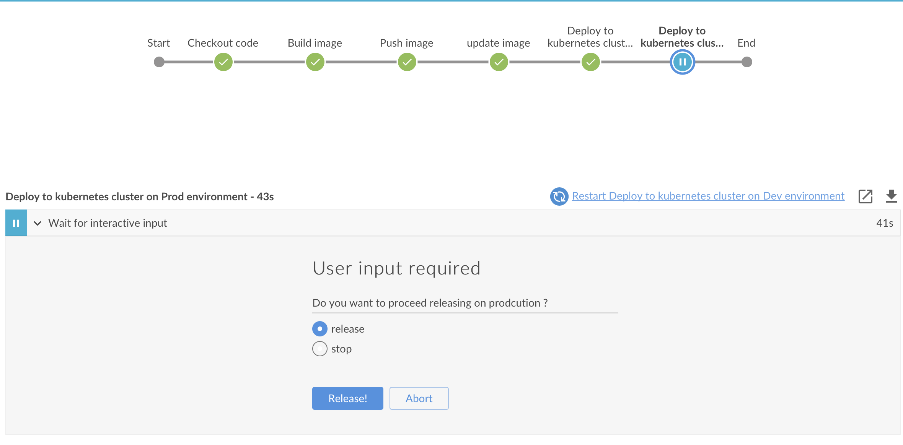
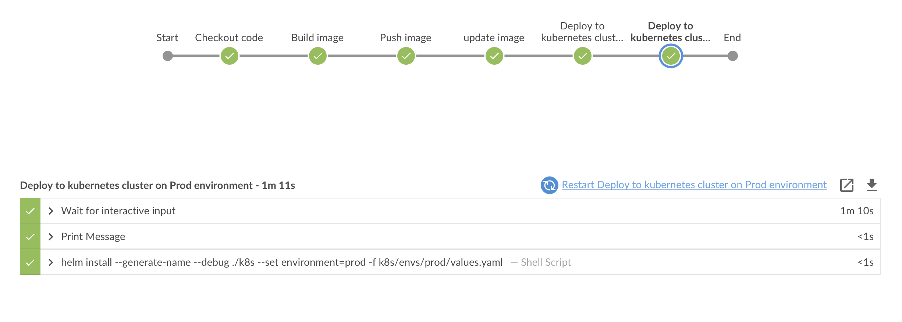
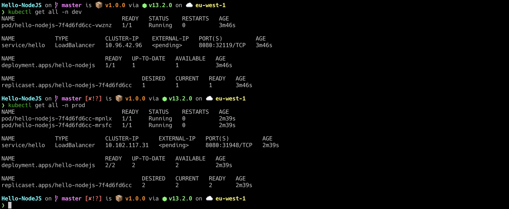

## General Idea
### Simply once we push the application code is pushed to Github the configured github webhook will trigger a configured jenkins job to start the pipeline which is written in file (Jenkinsfile)

## Pipeline stages and strategies 
#### The pipleline consist of 5 stages: 
- Check out the code form the configured git repo 
- Build the docker out of the code in git repo
- Push the generator docker image to the configured docker hub/repository 
- Deploy the docker image using Helm to kubernetes cluster on development environment 
- Give the options (Go/No go) to deploy the generated image to the production environment

#### Sample successful run

### Once you press release it will go to production 

### Results on kubernetes server it look like 


## Prerequisites: 
1. Jenkins Server with below requirements 
- Softwares: 
  - [x] Docker
  - [x] git
  - [x] kubectl 
  - [x] helm 
- Modules: 
  - [x] Git plugin
  - [x] Docker plugin (required for building/pushign the containers)
  - [x] Google Kubernetes Engine Plugin ( if we use GKE)
  - [x] Kubernetes CLI Plugin
  - [x] Blue Ocean (for better visualization of the pipelines)
  
2. Available cluster on Either GKE or EKS: 
   - for K8S on GKE or EKS: 
      - IAM user with access to kubernetes apis
      - Enable below APIs:
        - [x] Compute Engine API
        - [x] Kubernetes Engine API
        - [x] Service Management API
        - [x] Cloud Resource Manager API

3. Configure secrets:
   - [x] Git repo url and credentails if it's private repo  
   - [x] Docker hub/private repository secret
   - [x] Kuberentes keys

### Github -> Jenkins Webhook 
### Github > setting > webhooks > add webhook
```
http://Jenkins-IP:8080/github-webhook/
```

### Usage (manual k8s chart setp)
```bash
# for development environment 
helm install --generate-name  --debug ./k8s/ --set environment=dev  -f k8s/envs/dev/values.yaml
# for production environment 
helm install --generate-name  --debug ./k8s/ --set environment=prod  -f k8s/envs/prod/values.yaml
```

#### There are many ways ways to build deploy on multi-environments
1. one cluster contains two name spaces one for production and another for development environment , that's what i configured in Jenkinsfile
2. two clusters one per environment and that's what i did in file (Jenkinsfile_mutliecluster.gce) in same repo , if we need to make it effective either we rename it to Jenkinsfile or we change the pipeline filename from the created jenkins job to Jenkinsfile_mutliecluster.gce

#### As well we can build Multibranch Pipeline Project so whenever the developer pushes a code to the git repo only the development branch pipeline will be triggered and the new artifact will be deployed on the development environment requester merges development branch with master branch and approver approves it then the production pripeline will be triggered and the new artifact will be deployed to production namespace/cluster. 

### Moreover we can use **ansible** to take over deploying the new artifacts on different kubernetes namesapecs/clusters 

## Deployment strategies: 
1. We can use **istio** as service mesh to acheive different deployment strategies like 
   - Blue/green or black/red deployment
   - Canary deployment and this can be manually done or fully automated using flagger 
   - We can use istio to do a traffic mirroring, routing and injection. 
2. We can use **ArgoCD** or **Flux** as GitOps tool which is kubernetes controller that continuously monitors running applications and compares the current live state against the desired target state written in the infrasturcture git repos.   
