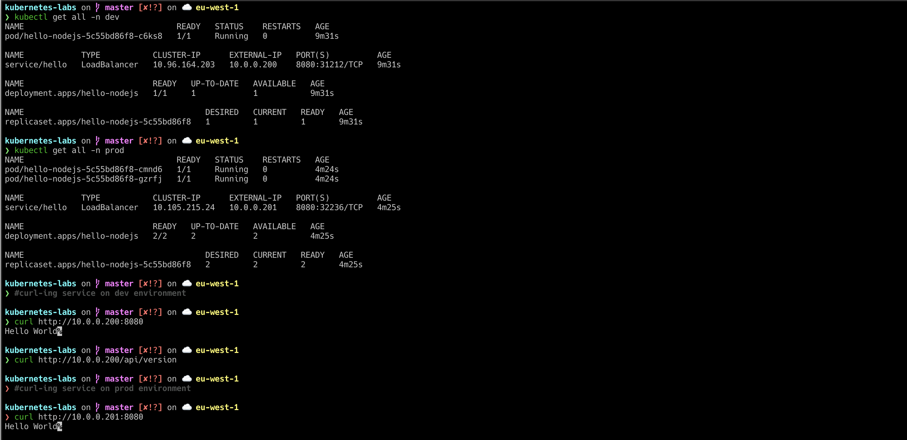

## General Idea
### Simply once we push the application to Github then a configured github webhook will trigger a configured jenkins job to start the pipeline which is written in file `Jenkinsfile`

## Pipeline stages and strategies 
### The pipleline consist of 5 stages: 
- Check out the code form the configured git repo 
- Build the docker out of the code in git repo
- Push the generator docker image to the configured docker hub/repository 
- Deploy the docker image using Helm to kubernetes cluster on development environment 
- Give the options (Go/No go) to deploy the generated image to the production environment

# Pipeline sample run

### Once you press release it will go to production 

### Results on kubernetes server it look like 


## Prerequisites: 
1. Jenkins Server with below requirements 
- Softwares: 
  - [x] Docker
  - [x] git
  - [x] kubectl 
  - [x] helm (version 3)
- Modules: 
  - [x] Git plugin
  - [x] Docker plugin (required for building/pushign the containers)
  - [x] Google Kubernetes Engine Plugin ( if we use GKE)
  - [x] Kubernetes CLI Plugin
  - [x] Blue Ocean (for better visualization of the pipelines)
  
2. Available cluster on Either GKE or EKS: 
   - for K8S on GKE or EKS: 
      - IAM user with access to kubernetes apis
      - Enable below APIs:
        - [x] Compute Engine API
        - [x] Kubernetes Engine API
        - [x] Service Management API
        - [x] Cloud Resource Manager API

3. Configure secrets:
   - [x] Git repo url and credentails if it's private repo  
   - [x] Docker hub/private repository secret
     
   - [x] Kuberentes keys
     

This project provides the following files:

|File	| Description| 
|--------------------------- | -----------------------------|
|k8s/Chart.yaml |	The definition file for your application| 
|k8s/values.yaml | Configurable values that are inserted into the following template files| 
|k8s/templates/deployment.yaml | Template to configure your application deployment|
|k8s/templates/service.yaml | Template to configure your application service|
|k8s/templates/namespace.yaml	| Template to configure your application namespace| 
|k8s/env/dev/values.yaml | Configurable values for development environment that are inserted into the following template files|
|k8s/env/prod/values.yaml	| Configurable values for production environment that are inserted into the following template files| 
|Dockerfile |	Docker file denfination |
|Jenkinsfile |	Jenkins pipeline |

### Github to Jenkins integration 
### Github > setting > webhooks > add webhook
```
http://Jenkins-IP:8080/github-webhook/
```

### Usage (manual k8s chart steps)
```bash
# install on development environment 
helm install --generate-name  --debug ./k8s/ --set environment=dev  -f k8s/envs/dev/values.yaml # or replace -f with --values 
# install on production environment 
helm install --generate-name  --debug ./k8s/ --set environment=prod  -f k8s/envs/prod/values.yaml # or replace -f with --values 
# delete an installed chart 
helm delete `ChartName`
helm uninstall `ChartName`
```

### There are different ways to deploy on multi-environments, for example
1. one cluster contains two name spaces , one namespace for production and another one for development environment , that's what i configured in Jenkinsfile with this setup we still can limit the resources access for the non-production as well we can segrate between both namespaces on network level to make then completely isolated with no impact from non production environments on the other production environment
2. two clusters one per environment and that's what i did in file (Jenkinsfile_mutliecluster.gce) in same repo , if we need to make it effective either we rename it to Jenkinsfile or we change the pipeline filename from the created jenkins job to Jenkinsfile_mutliecluster.gce

#### As well we can build `multibranch pipeline project` , so whenever the developer pushes a code to the git repo only the development branch pipeline will be triggered and the new artifact will be deployed on the development environment requester merges development branch with master branch and approver approves it then the production pripeline will be triggered and the new artifact will be deployed to production namespace/cluster. 
#### Moreover we can use ``ansible`` to take over deploying the new artifacts on different kubernetes namesapecs/clusters 

### Istio integration: 
   We can use **istio** as service mesh to acheive different deployment strategies , i have written a step-by-step guide on how to integrate istio with kubernetes and make use of different deployments features that istio offers https://github.com/moazrefat/K8S-Bonus/tree/master/istio 
### Deployments strategies
   - Blue/green or black/red deployment
   - Canary deployment and this can be manually done or fully automated using flagger i already wrote a flagger tutorial on how to setup and configure flagger to fully take over the candary releases and integrate it with different metric monitoring tools to take the decision either to move forward or to rollback , you can check my other repository https://github.com/moazrefat/K8S-Bonus/tree/master/flagger 
   - We can use istio to do a traffic mirroring, routing and injection
  
### Gitops with kubernetes
We can use **ArgoCD** or **Flux** as GitOps tool which is kubernetes controller that continuously monitors running applications and compares the current live state against the desired target state written in the infrasturcture git repos and apply the change if any change occurs.    
